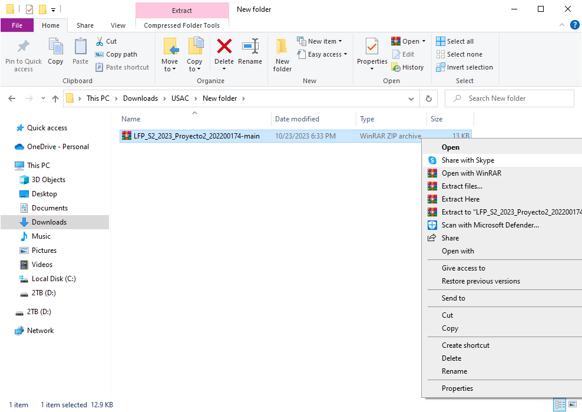
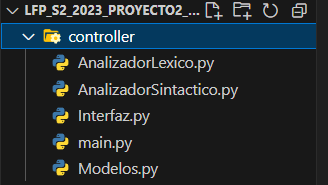
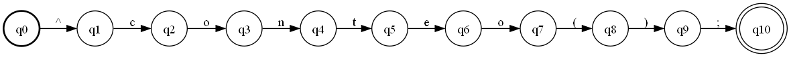

# Manual Técnico - BizData
Nombre del Estudiantes: Andres Alejandro Quezada Cabrera

Carné: 202200174

Curso y Sección: LENGUAJES FORMALES DE PROGRAMACIÓN Sección B+

## Introducción

Este manual técnico está diseñado para proporcionar una comprensión profunda de BizData, una plataforma especializada en análisis de datos comerciales dirigida a pequeñas empresas. BizData permite a las empresas tomar decisiones fundamentadas y estratégicas basadas en la importación y análisis de datos estructurados en un formato exclusivo con extensión ".bizdata". Los estudiantes de Lenguajes Formales y de Programación desempeñan un papel esencial en la creación de un analizador léxico y sintáctico en Python que permite a las empresas cargar y analizar datos en este formato particular.

A lo largo de este manual, se describirán en detalle las características clave del lenguaje utilizado en BizData, que incluyen la importación de datos, comentarios y una variedad de instrucciones de reportería. La importación de datos se divide en dos secciones: Claves y Registros, donde se definen las claves que componen los registros y se detallan los registros que se analizarán.

El manual también abordará cómo realizar operaciones de reportería en los datos importados. Estas operaciones incluyen la impresión de datos, el conteo de registros, el cálculo del promedio, la búsqueda y conteo de registros que cumplan ciertos criterios, la suma, así como la identificación de valores máximos y mínimos en campos específicos. Además, se explicará cómo exportar informes en formato HTML con títulos personalizados.

Este manual servirá como una guía completa para los estudiantes y desarrolladores que deseen comprender y trabajar con BizData, permitiéndoles construir analizadores léxicos y sintácticos eficaces y aprovechar al máximo esta plataforma de análisis de datos diseñada para impulsar la toma de decisiones informadas y estratégicas en el entorno empresarial.

### INSTALACIÓN DEL PROGRAMA Y USO DEL PROGRAMA
Ir al siguiente link: [MrQS94/LFP_S2_2023_Proyecto2_202200174 (github.com)](https://github.com/MrQS94/LFP_S2_2023_Proyecto2_202200174/). Acá encontrarán los src y el código fuente del programa.
 - Primero seleccionar en el botón code y seleccionar en descargar zip.

 - Luego de eso se descargará un archivo zip el cual necesitaremos extraer en una carpeta deseada, esta carpeta puede estar en cualquier lugar de su computadora, pero lo podemos incluir dentro de alguna carpeta de VS.

Abrimos el proyecto, luego de eso a nosotros nos aparecerá, cuatro paquetes los cuales son llamados app, img, package, src y los manuales, en el paquete app se encuentra el archivo que inicia el programa main.py.
Ahora en el paquete controller se encuentran los siguientes archivos

 - AnalizadorLexico.py
 - AnalizadorSintactico.py
 - main.py
 - Modelos.py
 - Interfaz.py 

El módulo **"AnalizadorLexico.py"**
Un analizador léxico se encarga de dividir el código fuente en tokens, que son unidades léxicas como identificadores, operadores y palabras clave.

En este caso, `AnalizadorLexico` que contiene métodos para analizar un archivo de entrada y dividirlo en tokens y errores léxicos. Los tokens se almacenan en una lista llamada `tokens` y los errores léxicos se almacenan en una lista llamada `errores`. El código realiza un análisis caracter por carácter del archivo de entrada, determinando el tipo de token para cada carácter y construyendo el lexema correspondiente. También maneja varios estados para tratar con diferentes situaciones, como comentarios, cadenas de texto y números.

El analizador léxico identifica tokens válidos y maneja errores léxicos en el código fuente proporcionado. Es importante mencionar que este código es específico para el lenguaje que está analizando, ya que contiene palabras clave y símbolos específicos del lenguaje que está siendo procesado.

El módulo **"AnalizadorSintactico.py"**
Este analizador recibe una lista de tokens como entrada y analiza la estructura sintáctica del código fuente. Está diseñado para reconocer instrucciones relacionadas con la manipulación de datos, como operaciones matemáticas, impresión y exportación de datos. El analizador utiliza una serie de reglas gramaticales para validar la entrada y generar un árbol de análisis sintáctico. Además, incluye funciones para calcular el mínimo y el máximo de un conjunto de datos. También puede exportar datos a un archivo HTML para su visualización. El código está estructurado en clases y métodos que representan diferentes partes del análisis sintáctico y utiliza la biblioteca PrettyTable para formatear los datos tabulares. También maneja errores sintácticos y genera informes de errores. El código es específico para un lenguaje de programación definido por ciertas palabras clave y estructuras sintácticas.

El módulo **"Interfaz.py"**
Es una interfaz gráfica de usuario (GUI) desarrollada en Python utilizando el módulo `tkinter`. La interfaz permite abrir archivos de un lenguaje específico, realizar análisis léxicos y sintácticos sobre el contenido del archivo y generar varios tipos de reportes, como errores léxicos y sintácticos, tokens encontrados y un árbol de derivación. La interfaz incluye funcionalidades para cargar archivos, analizar el contenido, mostrar resultados en la interfaz y generar reportes en formato HTML.

## Expresiones Regulares
1.  **imprimir("cadena");** Expresión regular: `^imprimir\("([^"]+)"\);$`
    
2.  **imprimirln("cadena");** Expresión regular: `^imprimirln\("([^"]+)"\);$`
    
3.  **conteo();** Expresión regular: `^conteo\(\);$`
    
4.  **promedio("campo");** Expresión regular: `^promedio\("([^"]+)"\);$`
    
5.  **contarsi("campo", valor);** Expresión regular: `^contarsi\("([^"]+)",\s*"([^"]+)"\);$`
    
6.  **datos();** Expresión regular: `^datos\(\);$`
    
7.  **sumar("campo");** Expresión regular: `^sumar\("([^"]+)"\);$`
    
8.  **max("campo");** Expresión regular: `^max\("([^"]+)"\);$`
    
9.  **min("campo");** Expresión regular: `^min\("([^"]+)"\);$`
    
10.  **exportarReporte("titulo");** Expresión regular: `^exportarReporte\("([^"]+)"\);$`
## Metodo del árbol
**imprimir("cadena");**

**imprimirln("cadena");**

**conteo();**

**promedio("campo");**

**contarsi("campo", valor);**

**datos();**

**sumar("campo");**

**max("campo");**

**min("campo");**

**exportarReporte("titulo");**

## AFD
**imprimir("cadena");**

**imprimirln("cadena");**

**conteo();**

**promedio("campo");**

**contarsi("campo", valor);**

**datos();**

**sumar("campo");**

**max("campo");**

**min("campo");**

**exportarReporte("titulo");**

## Gramática Independiente del Contexto
**imprimir("cadena");**

**imprimirln("cadena");**

**conteo();**

**promedio("campo");**

**contarsi("campo", valor);**

**datos();**

**sumar("campo");**

**max("campo");**

**min("campo");**

**exportarReporte("titulo");**
