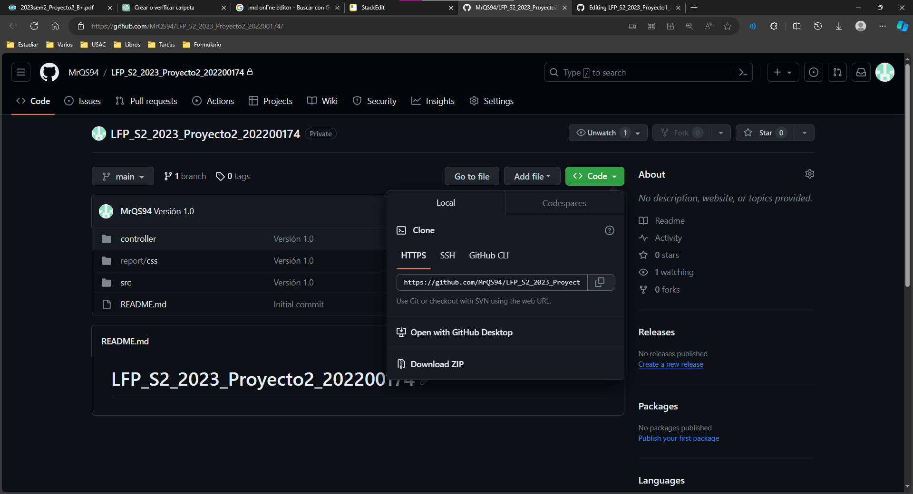
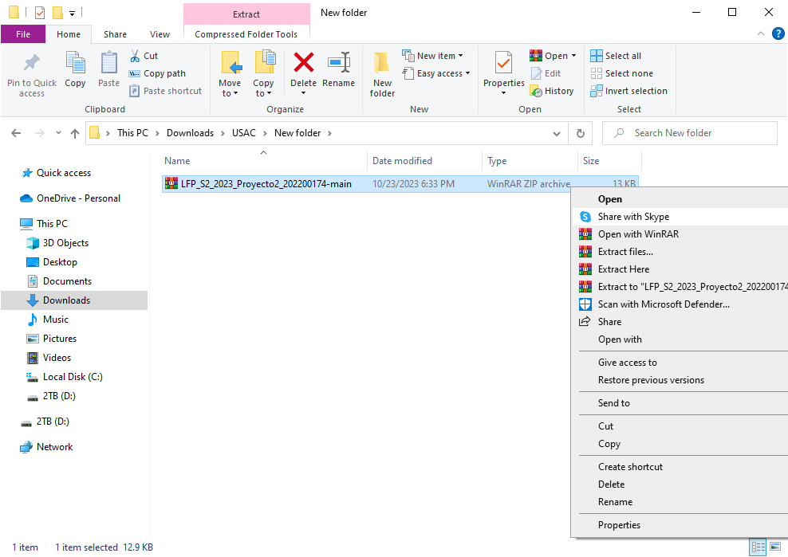
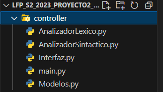

# Manual Usuario - BizData
Nombre del Estudiantes: Andres Alejandro Quezada Cabrera

Carné: 202200174

Curso y Sección: LENGUAJES FORMALES DE PROGRAMACIÓN Sección B+
## Introducción

Bienvenido al Manual del Usuario de BizData, la plataforma especializada en análisis de datos comerciales diseñada para pequeñas empresas. Este manual está creado para proporcionarte una comprensión completa de cómo utilizar BizData para tomar decisiones fundamentadas y estratégicas basadas en la importación y análisis de datos estructurados en un formato exclusivo con extensión ".bizdata".

### INSTALACIÓN DEL PROGRAMA Y USO DEL PROGRAMA
Ir al siguiente link: [MrQS94/LFP_S2_2023_Proyecto2_202200174 (github.com)](https://github.com/MrQS94/LFP_S2_2023_Proyecto2_202200174/). Acá encontrarán los src y el código fuente del programa.
 - Primero seleccionar en el botón code y seleccionar en descargar zip.

 - Luego de eso se descargará un archivo zip el cual necesitaremos extraer en una carpeta deseada, esta carpeta puede estar en cualquier lugar de su computadora, pero lo podemos incluir dentro de alguna carpeta de VS.

Abrimos el proyecto, luego de eso a nosotros nos aparecerá, cuatro paquetes los cuales son llamados app, img, package, src y los manuales, en el paquete app se encuentra el archivo que inicia el programa main.py.
Ahora en el paquete controller se encuentran los siguientes archivos

 - AnalizadorLexico.py
 - AnalizadorSintactico.py
 - main.py
 - Modelos.py
 - Interfaz.py 

El módulo **"AnalizadorLexico.py"**
1. Cómo Utilizar el Analizador Léxico
Para utilizar el Analizador Léxico, siga estos pasos:

a. Importar el Módulo
Asegúrese de importar el módulo AnalizadorLexico en su programa.

**from AnalizadorLexico import AnalizadorLexico**

b. Crear una Instancia del Analizador Léxico
Cree una instancia del analizador léxico.

**analizador = AnalizadorLexico()**

c. Analizar un Archivo de Entrada
Utilice el método analizar_archivo(archivo) para analizar un archivo de código fuente.

**analizador.analizar_archivo("archivo_de_codigo.txt")**

d. Obtener Tokens y Errores Léxicos
Después de analizar el archivo, puede obtener la lista de tokens y errores léxicos.

**tokens = analizador.tokens**

**errores = analizador.errores**

1. Interpretación de Resultados
La lista tokens contiene todos los tokens válidos encontrados en el código fuente.
La lista errores contiene cualquier error léxico detectado durante el análisis.
2. Manejo de Errores
Si encuentra errores léxicos en su código fuente, revise la lista de errores para identificar los problemas específicos. Corrija los errores en su código y vuelva a ejecutar el Analizador Léxico para verificar la corrección.

El módulo **"AnalizadorSintactico.py"**
Este analizador es como un detective especializado en lenguaje de programación. Su trabajo es revisar una lista de palabras clave y símbolos que componen un código fuente y entender cómo funcionan juntos. Su enfoque principal es identificar las partes del código que se encargan de hacer cálculos matemáticos, mostrar información en la pantalla y guardar datos en un formato especial.

Para hacer su trabajo, el analizador sigue un conjunto de reglas gramaticales, como si fueran pistas, para asegurarse de que el código tenga sentido. Luego, organiza la información de manera jerárquica, como un árbol, para que sea más fácil de entender.

Además de eso, puede hacer algunas tareas adicionales, como encontrar el número más pequeño y el más grande en un grupo de datos. También puede ayudar a convertir los datos en un formato que se ve bien en una página web, como un documento HTML.

Para hacer todas estas cosas, el código del analizador está dividido en diferentes partes, como capítulos en un libro, cada una de las cuales tiene su función específica. Además, utiliza una herramienta llamada PrettyTable para que la información se vea organizada y fácil de leer. Si encuentra errores en el código que está analizando, los señalará y generará un informe para que puedas corregirlos.

El módulo **"Interfaz.py"**
Esta es una interfaz visual creada con Python usando la herramienta `tkinter`. Permite abrir archivos escritos en un lenguaje específico y luego analizar el texto para encontrar errores y estructuras gramaticales. También puede generar informes detallados, como errores encontrados, palabras clave identificadas y una representación gráfica de la estructura del texto. Puedes cargar archivos, analizarlos y ver los resultados directamente en la interfaz, además de generar informes en formato HTML para revisar más tarde.